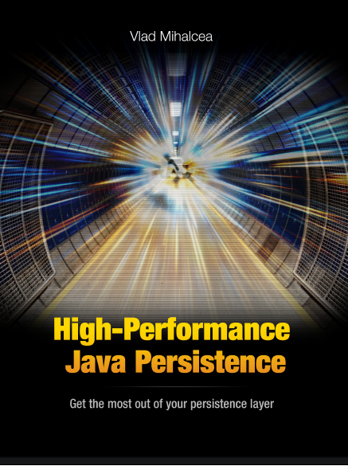

+++
author = "Quang Nguyen"
title = "Technical Books for the Beginning of 2024"
date = "2024-01-08"
description = "The project I am working on is facing a performance problems related to database and data access layer. Then I just grabbed some interesting books and started delving into them"
tags = [
    "technical",
    "programming",
    "java",
    "hibernate",
    "sql",
    "database"
]
categories = [
    "work",
    "programming",
]
series = ["Books"]
toc = false
+++

## High Performance Java Persistence

- Github Repository: [link](https://github.com/vladmihalcea/high-performance-java-persistence)

- The `codebase` in the `repository` is `well-organized`, you would learn much just by cloning and running the `unit tests`.

- Cover:

### Content

#### JDBC and Database Essentials

> The first part aims to reduce the gap between application developers and database administrators.
> 
> For this reason, it covers both JDBC and the database fundamentals that are of paramount importance when reducing transaction response times. In 
> this first part, you'll learn about connection management, batch 
> updates, statement caching, result set fetching and database 
> transactions.

#### JPA and Hibernate

> The second part demonstrates how you can take advantage of JPA and Hibernate without compromising application performance. 
> 
> In this second part, you'll learn about the most efficient Hibernate mappings (basic types, associations, inheritance), fetching best practices, caching and concurrency control mechanisms.

#### jOOQ Object Oriented Querying

> The third part is dedicated to jOOQ and its powerful type-safe querying capabilities, like window functions, common table expressions, upsert, stored procedures and database functions.

### PostgreSQL 14 Internals

This is a `free` book but really high quality - [PostgreSQL 14 Internals : Postgres Professional](https://postgrespro.com/community/books/internals)

Contents at a glance:

- Part I. Isolation and MVCC
  
  - Isolation
    
    - Pages and Tuples
    
    - Snapshots
    
    - Page Pruning and HOT Updates
    
    - Vacuum and Autovacuum
    
    - Freezing
    
    - Rebuilding Tables and Indexes

- Part II. Buffer Cache and WAL
  
  - Buffer Cache
  
  - Write-Ahead Log
  
  - WAL Modes

- Part III. Locks
  
  - Relation-Level Locks
  
  - Row-Level Locks
  
  - Miscellaneous Locks
  
  - Locks in Memory

- Part IV. Query Execution
  
  - Query
    
    - Execution Stages
    
    - Statistics
    
    - Table Access Methods
    
    - Index Access Methods
      
      - Index Scan
      
      - Nested Loop
      
      - Hashing
      
      - Merging and Sorting

- Part V. Types of Indexes
  
  - Hash
  
  - B-Tree
  
  - GiST
  
  - SP-GiST
  
  - GIN
  
  - BRIN