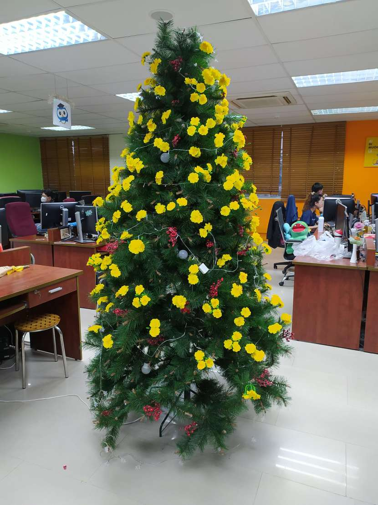

+++
author = "Quang Nguyen"
title = "'Thong Mai' tree and Singleton Bean in Spring should be stateless"
date = "2024-01-09"
description = "I've traced and tried to figure out the weird behavior from the Spring logs... It turned out that the logging code is wrong due to things like stateful singleton bean in Spring!... Also, I would like to introduce a 'Thong Mai' concept :D"
tags = [
    "technical",
    "programming",
    "spring",
    "concurrent",
]
categories = [
    "work",
    "programming",
    "life"
]
series = ["Daily"]
toc = false
+++

## Stateful Singleton Bean in Spring

I would not reinvent the wheel since the Internet has many good articles on this topic. For example: [Baeldung article on spring singleton concurrent  requests.](https://www.baeldung.com/spring-singleton-concurrent-requests#stateless-singleton-beans-vs-stateful-singleton-beans)

Code snippet from the article

```java
@Service
public class ProductService {
    // since the bean's scope is singleton, this instance variable is not thread-safe
    private String productName = null;
    // ...

    public Optional getProductById(int id) {
        // ...
        productName = product.map(Product::getName).orElse(null);

       // ...
    }
}
```
running log:
```log
Thread: pool-2-thread-2; bean instance: com.baeldung.concurrentrequest.ProductService@7352a12e; product id: 2 has the name: Product 2
Thread: pool-2-thread-1; bean instance: com.baeldung.concurrentrequest.ProductService@7352a12e; product id: 1 has the name: Product 2
```

I've copied the code just to test my site's ability to rendering code.

Remark: It requires your understanding of
- Dependency Injection
- Spring Inversion of Control - Spring IOC containers
- Singleton bean (default scope, other scopes: prototypes, applications, etc...)
- Java thread-safe and anomalies like race conditions

to fully understand what's happening.

## 'Thong Mai' Tree

'Thong Mai' is not a tree-family data structure. It's... just a Christmas tree decorated with yellow flowers for the upcoming Tet's holiday :D


