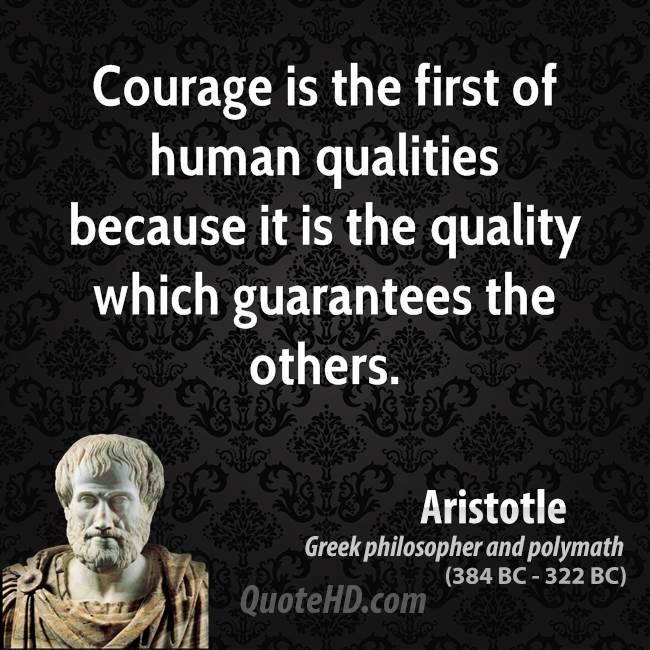

+++
author = "Hoang Manh Hai"
title = "Tại sao tôi ưa viết chuyện tâm linh"
date = "2024-01-07"
description = "Nhiều người không thích, thậm chí cho rằng tôi đã làm lây lan sự bi quan cho bạn đọc khi thấy rất nhiều bài viết của tôi chỉ ra những điểm tiêu cực trong tính cách con người, trong xã hội mình đang sống và đôi lúc tôi “nói xấu” cả nhân loại nữa."
tags = [
    "nhan-sinh-quan",
    "tam-linh",
    "tieng-viet",
    "hoc-lam-nguoi",
]
categories = [
    "life"
]
series = ["Repost"]
toc = false
+++

Bài viết copy từ facebook của thầy Hoàng Mạnh Hải: [link](https://www.facebook.com/manhhai.hoang.1/posts/pfbid02MNB1ZvSJRwcM8UqqFFofbp2K36XbZdACSUzocSrAWcdF8K2Ti5vCf5EiwvqvCr8dl?__cft__[0]=AZV_LypUbWjBDeOZ1RweBIk-IZuWiYKXeAyBtvNPgKNRra9gg8DoJjAy4rEk1L7qe8RsE5hx9rRCXR_5XUFaW-nzb8CrIjjJxqtNlETSzj7Y3DfYSGYMApGcUd6yNjki-Ek&__tn__=%2CO%2CP-R)

Nhiều người không thích, thậm chí cho rằng tôi đã làm lây lan sự bi quan cho bạn đọc khi thấy rất nhiều bài viết của tôi chỉ ra những điểm tiêu cực trong tính cách con người, trong xã hội mình đang sống và đôi lúc tôi “nói xấu” cả nhân loại nữa. Thực ra, tôi chỉ đang cố gắng níu giữ một phần nhỏ định nghĩa của giới trí thức mà thôi: “𝑇𝑟𝑖́ 𝑡ℎ𝑢̛́𝑐 𝑙𝑎̀ 𝑛𝑔𝑢̛𝑜̛̀𝑖 𝑐𝑜́ 𝑘𝑖𝑒̂́𝑛 𝑡ℎ𝑢̛́𝑐 𝑡𝑟𝑜𝑛𝑔 𝑥𝑎̃ ℎ𝑜̣̂𝑖 𝑣𝑎̀ 𝑏𝑖𝑒̂́𝑡 𝑐𝑎̂́𝑡 𝑡𝑖𝑒̂́𝑛𝑔 𝑛𝑜́𝑖 𝑡ℎ𝑎𝑦 𝑐ℎ𝑜 𝑛ℎ𝑢̛̃𝑛𝑔 𝑛𝑔𝑢̛𝑜̛̀𝑖 𝑖́𝑡 ℎ𝑖𝑒̂̉𝑢 𝑏𝑖𝑒̂́𝑡 ℎ𝑜̛𝑛 ℎ𝑜̣”. Trừ khi quyết định rút lui không làm một người trí thức nữa, tôi sẽ không chọn sống kiểu mũ ni che tai, nhắm mắt làm ngơ trước cảnh khổ của con người.  

Từ đó, các bạn sẽ thấy rằng trong xã hội hiện nay người trí thức thực sự (Chân trí thức) là rất ít. Ngụy trí thức thì rất nhiều. Nguyên nhân là do chúng ta không được dạy và học môn triết một cách đàng hoàng để biết lòng can đảm là phẩm chất đầu tiên phải có của con người vì nó bảo đảm cho các phẩm chất khác (𝑨𝒓𝒊𝒔𝒕𝒐𝒕𝒍𝒆: “𝑪𝒐𝒖𝒓𝒂𝒈𝒆 𝒊𝒔 𝒕𝒉𝒆 𝒇𝒊𝒓𝒔𝒕 𝒐𝒇 𝒉𝒖𝒎𝒂𝒏 𝒒𝒖𝒂𝒍𝒊𝒕𝒊𝒆𝒔 𝒃𝒆𝒄𝒂𝒖𝒔𝒆 𝒊𝒕 𝒊𝒔 𝒕𝒉𝒆 𝒒𝒖𝒂𝒍𝒊𝒕𝒚 𝒘𝒉𝒊𝒄𝒉 𝒈𝒖𝒂𝒓𝒂𝒏𝒕𝒆𝒆𝒔 𝒕𝒉𝒆 𝒐𝒕𝒉𝒆𝒓𝒔”). Hầu hết mọi người đều thiếu can đảm và tôi cũng không khác gì hơn.  

Vậy thì phê phán tính cách của con người, phê phán những cái xấu xã hội và phê phán chung cả nhân loại thì cái nào đòi hỏi nhiều can đảm hơn? Theo tôi thì “nói xấu nhân loại” an toàn hơn cả và lòng can đảm của tôi cũng chỉ tới đó. Tôi ưa nói chuyện tâm linh nhất, rồi khẽ khàng phê phán xã hội và chẳng bao giờ dám tấn công cá nhân ai.  

Quay lại chuyện đời sống tâm linh. Trong con người chúng ta cái Tâm là quan trọng nhất, rồi đến Trí, rồi đến Thân. Cho nên Thân nghiệp không bằng Khẩu nghiệp, Khẩu nghiệp không bằng Ý nghiệp. Trong ba loại tài khoản của mỗi người thì tài khoản Đức là có giá trị nhất, rồi đến tài khoản Uy tín và kém giá trị nhất là tài khoản Tiền. Ai hiểu về đời sống tâm linh sẽ nhận ra điều này không có gì khó.  

Tôi có nhiều dịp đứng lớp về lãnh đạo và quản lý cho các trung tâm. Tôi cũng có tổ chức lớp Coaching 1:1 mang tên “𝑻𝒉𝒂̀𝒏𝒉 𝒄𝒐̂𝒏𝒈 𝒕𝒓𝒐𝒏𝒈 𝒎𝒐̣̂𝒕 𝒄𝒖𝒐̣̂𝒄 đ𝒐̛̀𝒊 𝒄𝒐́ 𝒈𝒊𝒂́ 𝒕𝒓𝒊̣”. Trong các lớp đó tôi đều không có ý giúp học viên làm giàu. Nhiều người trong lớp đã có tài sản, tiền bạc hơn tôi. Tôi chỉ giúp họ quản lý và lãnh đạo giỏi hơn, theo nghĩa trở thành người có giá trị hơn, cho đời này và cho đời sau.  

Có giá trị hơn “cho đời này” bằng cách mang lại hạnh phúc cho người khác. Câu này còn dễ hiểu. Nhưng có giá trị hơn “cho đời sau” là gì, làm sao hiểu được nếu không có kiến thức về tâm linh? Các bạn không được học môn triết, không biết giáo lý của các tôn giáo thì đương nhiên cho rằng “chết là hết”, làm sao hiểu được đời sống tâm linh để mà vun đắp giá trị. Tôi xin lặp lại status trước: “𝐿𝑜𝑎̀𝑖 𝑘𝑖𝑒̂́𝑛 𝑘ℎ𝑜̂𝑛𝑔 𝑏𝑖𝑒̂́𝑡 𝑙𝑎̀ 𝑐𝑜́ 𝑐𝑜𝑛 𝑛𝑔𝑢̛𝑜̛̀𝑖, 𝑐𝑜𝑛 𝑛𝑔𝑢̛𝑜̛̀𝑖 𝑘ℎ𝑜̂𝑛𝑔 𝑏𝑖𝑒̂́𝑡 𝑙𝑎̀ 𝑐𝑜́ 𝑐ℎ𝑢̛ 𝑡ℎ𝑖𝑒̂𝑛 𝑡ℎ𝑖̀ 𝑙𝑜𝑎̀𝑖 𝑛𝑔𝑢̛𝑜̛̀𝑖 𝑣𝑎̀ 𝑐ℎ𝑢̛ 𝑡ℎ𝑖𝑒̂𝑛 𝑣𝑎̂̃𝑛 𝑐𝑜́…” Không biết gì về đời sống sau cái chết là một thiếu sót, một sự nguy hiểm vô cùng mà ta không nên để ai bị sa vào. Tôi tự thấy có đủ lòng can đảm để nói cho mọi người hiểu điều này vì ích lợi của nó quá lớn trong khi nguy hiểm thì chẳng bao nhiêu.  

Với tôi, câu “Chết không phải là hết” nếu so với câu “Hai cộng hai bằng bốn” thì nhiều phần chắc chắn hơn. Tại sao tôi biết?  

- 𝐕𝐚̆𝐧: Tôi đọc và nghe nhiều bậc trí giả, bậc giác ngộ, bậc thánh nói như thế và tôi tin như thế;  
- 𝐓𝐮̛: Tôi suy nghĩ, chiêm nghiệm, cân nhắc, phản biện… và đi đến kết luận như thế;  
- 𝐓𝐮: Tôi từng có dịp trải nghiệm những khoảnh khắc đặc biệt trong đời và kết luận như thế.  

Tóm lại, các bạn hãy sống một cuộc đời có giá trị, cho bây giờ và cho cả đời sau. Đừng ham thành công theo nghĩa tiền bạc nữa. Thực ra là đ𝑢̛̀𝑛𝑔 ℎ𝑎𝑚 𝑡ℎ𝑎̀𝑛ℎ 𝑐𝑜̂𝑛𝑔 𝑡ℎ𝑒𝑜 𝑏𝑎̂́𝑡 𝑘𝑦̀ 𝑛𝑔ℎ𝑖̃𝑎 𝑛𝑎̀𝑜. 𝐿𝑎̀ 𝑑𝑎𝑛ℎ, 𝑙𝑎̀ 𝑙𝑜̛̣𝑖 ℎ𝑎𝑦 𝑞𝑢𝑦𝑒̂̀𝑛 đ𝑒̂̀𝑢 𝑝ℎ𝑢̀ 𝑑𝑢…

